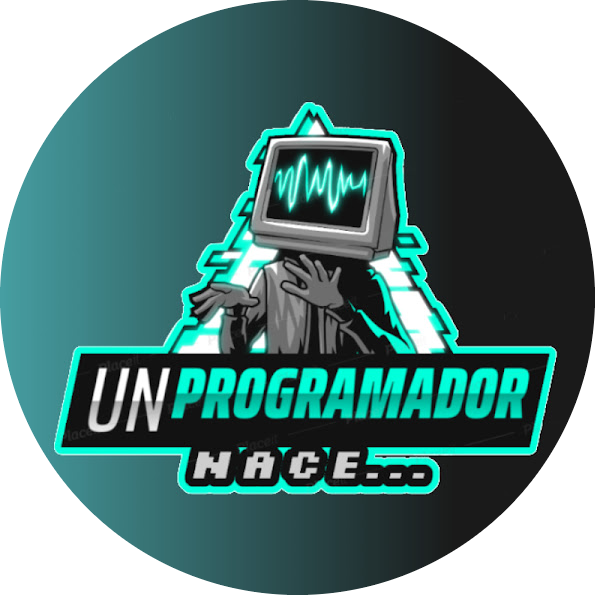
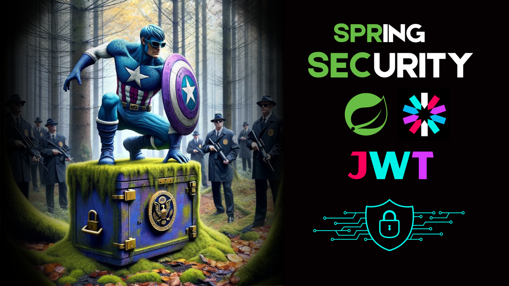
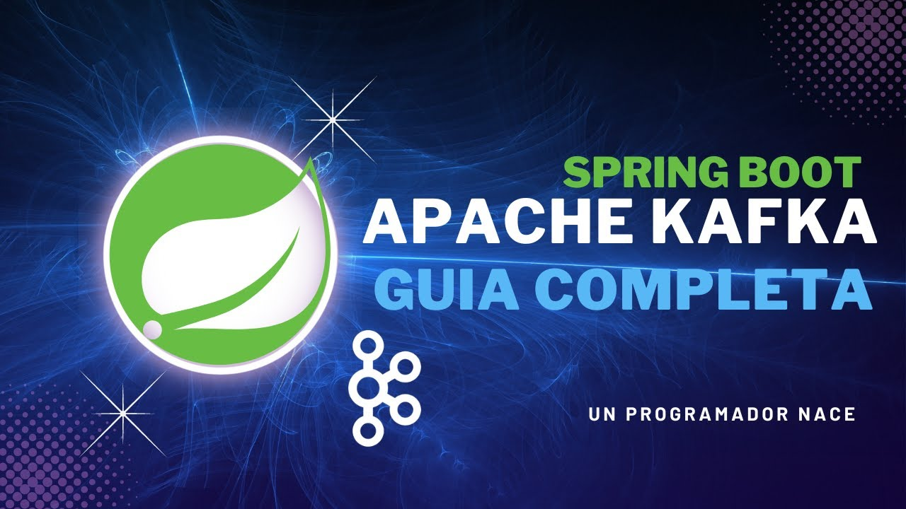
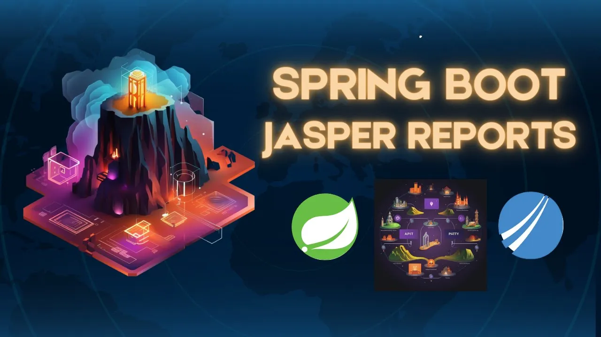

<!--  
 

    

 
  -->
<h1 align="center">Hello 👋 I am Santiago Perez</strong> ✨ </h1>

  

    
    
    
    
  

 
<h2 align="center">Sobre mi 😎🤏</h2>
<!--Intro start-->

🎓 ESTUDIANTE DE INGENIERIA DE SOFTWARE

📝 Desarrollador de software, proactivo y autodidacta, además de Youtuber de tecnología.

💻 Tengo unos cuantos años de experiencia trabajando con JAVA | SPRING FRAMEWORK | JAVASCRIPT

📫 Contacto: **unprogramadornace@gmail.com**

<!--Intro end-->
  

 

<h2 align="center">Tecnologías conocidas👨🏻‍💻</h2>
<!--tech stack icons-->

  <h2>:star2: Front End</h2>
  

  <h2>:zap: Back End</h2>
  

  <h2>:hammer: Devops</h2>
  

  <h2>:wrench: Tools</h2>
  

 
<!-------------------------->

 

<h2 align="left">Si quieres apoyarme 😻</h2>

  

 
 
<h2 >Algunos proyectos👨🏻‍💻</h2>

<table align="left" >
<tr border="none">
  <td width="25%" align="center">
    

     
      

    

        
        
    
       
</td>

<td width="25%" align="center">
    

        
    
 
    

        
        
    
 
</td>

  <td width="25%" align="center">
    

     
      

    

        
      
    
       
</td>

   <td width="25%" align="center">
    

     
      

    

        
      
    
       
</td>

<tr border="none">
  <td width="25%" align="center">
    

     
      

    

        
        
    
       
</td>

<td width="25%" align="center">
    

        
    
 
    

        
        
    
 
</td>
  
  <td width="25%" align="center">
    

     
      

    

        
      
    
       
</td>

   <td width="25%" align="center">
    

     
      

    

        
      
    
       
</td>
</tr>
</table>
  

<!------------------------->

  
<h2>GitHub :octocat:</h2>
<!--- stats & Trophy (start) -->

  <!--- stats (start) -->
<table align="center">
<tr border="none">
<td width="60%" align="center">

    
   
</td>

</tr>
</table>
<!--- stats (end) -->

<!--- trophy (start) -->

  

<!--- trophy (start) -->

       
 
 
 
 
